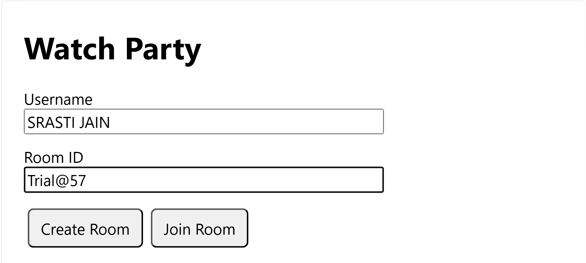
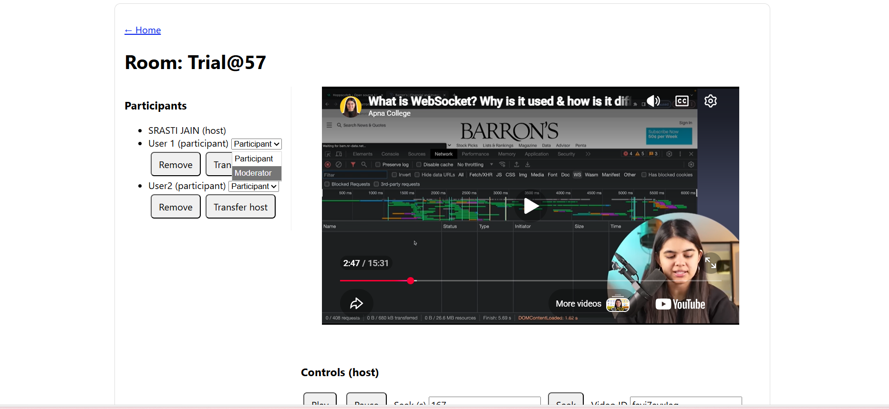
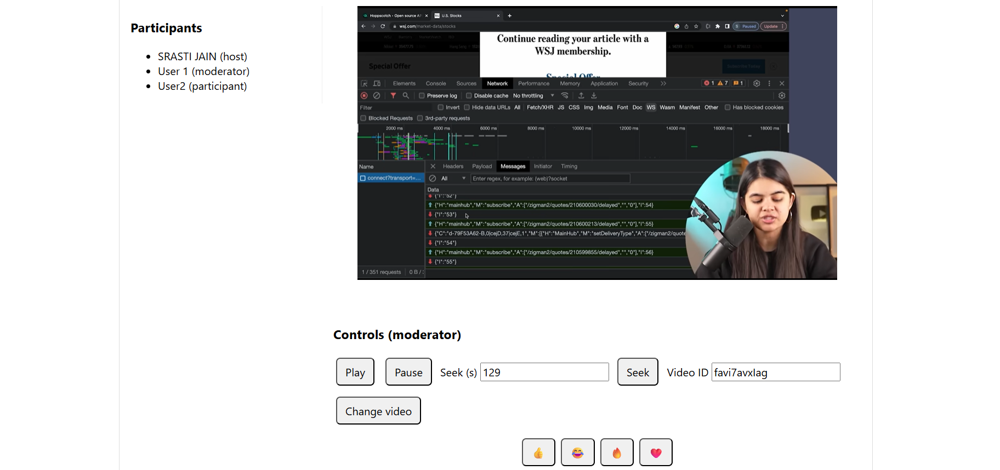
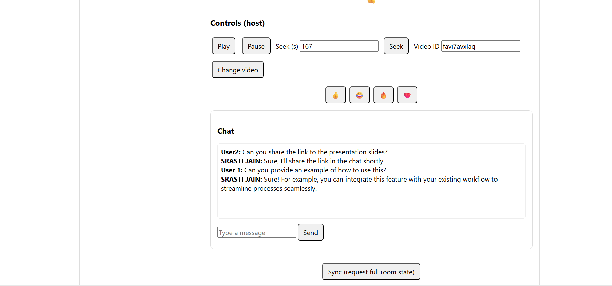

# YouTube Watch Party

## Live Links
- **Frontend (Live App)(Vercel)**: (https://yt-watch-party.vercel.app/)
- **Backend  (WebSocket Server)(Render)**: (https://yt-watch-party-backend.onrender.com)

## Description
YouTube Watch Party is a real-time watch party application where multiple users can watch YouTube videos together in sync. The app uses WebSockets to synchronize playback actions (play, pause, seek, and video changes) across all connected users in the same room.

## Features
- **Room-based system**: Create rooms and join via room ID.
- **Real-time sync**: Play, pause, seek, and video changes are synchronized across the room.
- **Role-based control**: Host, Moderator, and Participant roles with clear permissions.
- **Host controls room management**: Assign roles, manage participants, and oversee the session.
- **Moderator playback control**: Can control playback (play/pause/seek) and change video.
- **Participant view-only mode**: Watches in sync without controlling the player.
- **Chat system**: Enables real-time text messaging inside the room for all participants.
-**Emoji reactions**: Allows users to send emoji reactions during video playback to express live responses.

## Tech Stack
- **React + Vite**
- **Node.js + Express**
- **Socket.IO**
- **YouTube IFrame API**

## Setup Instructions
### Frontend
```bash
npm install
npm run dev
```

### Backend
```bash
npm install
node index.js
```

- **Start the backend first** so the WebSocket server is available before the frontend connects.
- **Ensure the frontend uses the backend URL** in the Socket.IO connection (use your local backend URL in development, and the Render URL in production).

## Architecture Overview
- **Client–server connection**: The frontend establishes a persistent Socket.IO connection to the Express backend.
- **Room state (in-memory)**: Rooms, participants, and role assignments are stored in memory on the server (non-persistent; resets on server restart).
- **Synchronized video state**: The server maintains the authoritative room state (e.g., `videoId`, `isPlaying`, `currentTime`) and broadcasts updates so all clients converge on the same player state.

## WebSocket Flow
Join room → assign role → host controls video → server validates role → broadcast updates to all users → all clients sync player state.

## YouTube Video input
Users must paste only the **YouTube video ID** (not full URL). The video ID is the unique identifier used to load and synchronize the video in the room.

**Example**
If the link is
`https://youtu.be/favi7avxIag?si=GQ_flXGY3_VeICTF`

Then the **video ID** is:
favi7avxIag
Because everything after youtu.be/ is the video ID, and the ?si=... part is just tracking info (not needed for embedding or syncing).

##**Screenshots**


###  Home Page


###  Watch Room (Real-time Sync)


###   Roles System


###  Features



